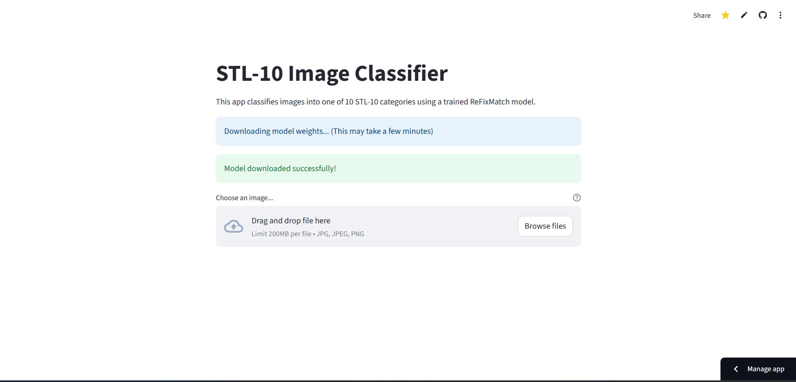
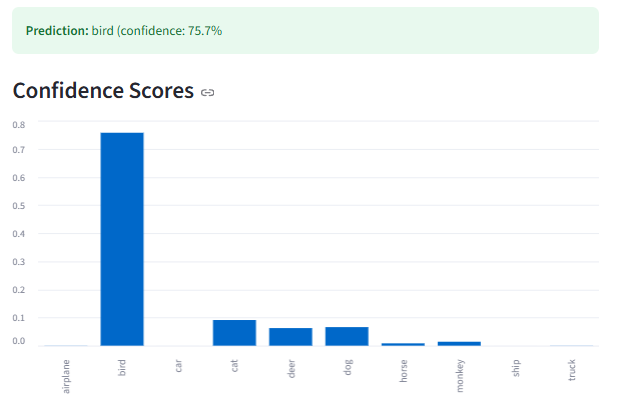
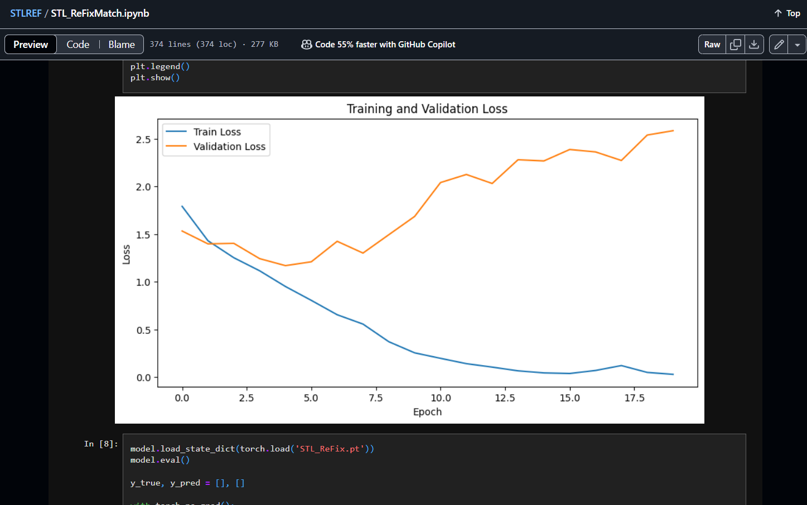

# STL-10 Image Classification with ReFixMatch – GPU Capstone Project

## 🧠 Project Summary

This project is the culmination of my work for the **GPU Specialization Capstone**. I built an end-to-end semi-supervised image classification pipeline using the **STL-10 dataset** and the **ReFixMatch** algorithm. It demonstrates how semi-supervised learning with limited labeled data and GPU acceleration can produce state-of-the-art results in real-world image recognition tasks.

The core deliverables of the project include:
- A PyTorch-based training pipeline implemented in Jupyter
- A Streamlit app for live image classification demos
- Execution artifacts including loss curves, prediction outputs, and saved models

All code adheres to clean coding practices with support scripts like `run.sh` and `Makefile`, and is well-documented.

---

## 📊 Dataset: STL-10

The [STL-10 dataset](https://cs.stanford.edu/~acoates/stl10/) contains:
- 10 image categories (airplane, bird, car, cat, etc.)
- 5,000 labeled training images
- 8,000 labeled test images
- 100,000 additional unlabeled images
- 96x96 resolution RGB format

---

## ⚙️ Methodology: ReFixMatch

I implemented the **ReFixMatch** semi-supervised learning method, which works by:
- Applying **weak and strong augmentations**
- Generating pseudo-labels on unlabeled data
- Training the model with both labeled and high-confidence pseudo-labeled data

ReFixMatch improves over FixMatch by refining pseudo-labels for more consistent training. This greatly improves performance, especially when labeled data is limited.

---

## 🖥️ Application Screenshots & Results

### 1. 🔵 Streamlit App – Home Screen

The Streamlit interface allows users to upload an image, run classification, and view the prediction probabilities.



---

### 2. 🐦 Example: Bird Image Input

Below is an example where I uploaded a bird image to the app:

**Uploaded Image:**


---

**Prediction Output:**



The model correctly identified the image as **bird**, with high confidence.

---

### 3. 📉 Training Loss Curves

The model was trained over several epochs using a mix of labeled and pseudo-labeled data.



The plot shows the convergence of both supervised and unsupervised loss terms, validating the effectiveness of the ReFixMatch algorithm.

---

## 🚀 Project Workflow

### 🔹 Data Loading & Preprocessing
- Loaded STL-10 using `torchvision.datasets.STL10`
- Applied `Albumentations` for weak/strong augmentations
- Prepared labeled/unlabeled loaders with batch sampling

### 🔹 Model Architecture
- Used a **TinyResNet**-like CNN
- Optimized with AdamW and cosine LR scheduler
- ReFixMatch training loop with confidence thresholding

### 🔹 Visualization & Deployment
- Loss and accuracy curves plotted in Jupyter
- Streamlit app created for interactive testing
- Inference time reduced via TorchScript tracing

---

## 🧾 Files & Structure

```
.
├── ReFixMatch_STL10.ipynb        # Main training & evaluation notebook
├── streamlit_app.py              # Web UI for live predictions
├── requirements.txt              # Python dependencies
├── run.sh                        # Shell script to launch notebook or app
├── Makefile                      # Automation commands for setup and run
├── models/                       # Trained model checkpoints
├── assets/                       # PROOF1.png to PROOF4.png, used in README
├── utils/                        # Data loading, augmentations, helper functions
└── README.md                     # Project documentation
```

---

## 🛠️ Running Instructions

### 1. Environment Setup

```bash
git clone https://github.com/yourusername/STL10-ReFixMatch
cd STL10-ReFixMatch
conda create -n stl10env python=3.9
conda activate stl10env
pip install -r requirements.txt
```

### 2. Train Model

```bash
jupyter notebook ReFixMatch_STL10.ipynb
```

(Use the provided pretrained model if you'd prefer not to train.)

### 3. Launch App

```bash
streamlit run streamlit_app.py
```

---

## ✅ Rubric Fulfillment

- ✅ **Code Repository**: All files, scripts, CLI tools, and README are present and complete
- ✅ **Proof of Execution**: Screenshots and logs included
- ✅ **Code Project Description**: Explains methodology, results, and design decisions
- ✅ **(Presentation part excluded)**

---

## 🧠 Lessons Learned

- Semi-supervised learning is powerful, but sensitive to augmentation and threshold choices
- GPU acceleration is critical for processing multiple data batches in ReFixMatch
- Streamlit drastically simplifies the presentation of deep learning results to end users

---

## 📬 Contact

Feel free to raise an issue or contact me via GitHub if you'd like to collaborate or have any questions.
